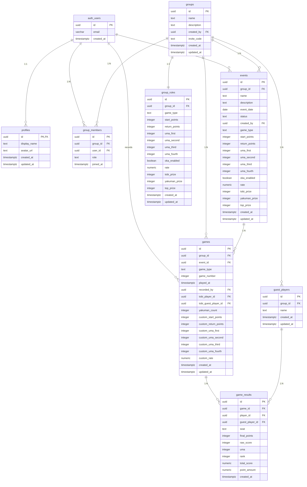

# データベーススキーマ設計

本プロジェクトでは、バックエンドサービスとしてSupabaseを採用しています。
Supabaseは、PostgreSQLを基盤としたオープンソースのバックエンドサービスです。

## 1. ER図

## 2. テーブル定義

### 2.1 auth.users (Supabase Auth)

Supabase Auth が管理するテーブル。直接操作せず参照のみ。

| カラム名 | 型 | 制約 | 説明 |
|---------|-----|------|------|
| id | uuid | PK | ユーザーID |
| email | varchar | NOT NULL | メールアドレス |
| created_at | timestamptz | | 作成日時 |

### 2.2 profiles

ユーザーの追加情報（Google アカウントから取得）

| カラム名 | 型 | 制約 | 説明 |
|---------|-----|------|------|
| id | uuid | PK, FK → auth.users(id) | ユーザーID |
| display_name | text | | 表示名 |
| avatar_url | text | | プロフィール画像URL |
| created_at | timestamptz | DEFAULT NOW() | 作成日時 |
| updated_at | timestamptz | DEFAULT NOW() | 更新日時 |

**インデックス**:
- `idx_profiles_id` on (id)

**RLSポリシー**:
- 自分のプロファイルは閲覧・更新可能

### 2.3 groups

麻雀グループ（サークル）の情報

| カラム名 | 型 | 制約 | 説明 |
|---------|-----|------|------|
| id | uuid | PK, DEFAULT gen_random_uuid() | グループID |
| name | text | NOT NULL | グループ名 |
| description | text | | グループ説明 |
| created_by | uuid | NOT NULL, FK → auth.users(id) | 作成者ID |
| invite_code | text | UNIQUE, NOT NULL | 招待コード（8文字ランダム） |
| created_at | timestamptz | DEFAULT NOW() | 作成日時 |
| updated_at | timestamptz | DEFAULT NOW() | 更新日時 |

**インデックス**:
- `idx_groups_created_by` on (created_by)
- `idx_groups_invite_code` on (invite_code)

**RLSポリシー**:
- グループメンバーのみ閲覧可能
- ログインユーザーはグループ作成可能
- グループ作成者のみ更新・削除可能

### 2.4 group_rules

グループのルール設定（東風/東南、ウマオカ、レート等）

| カラム名 | 型 | 制約 | デフォルト値 | 説明 |
|---------|-----|------|-------------|------|
| id | uuid | PK, DEFAULT gen_random_uuid() | | ルールID |
| group_id | uuid | NOT NULL, UNIQUE, FK → groups(id) | | グループID |
| game_type | text | NOT NULL, CHECK | 'tonnan' | 東風/東南 ('tonpuu' or 'tonnan') |
| start_points | integer | NOT NULL | 25000 | 開始点数 |
| return_points | integer | NOT NULL | 30000 | 返し点 |
| uma_first | integer | NOT NULL | 20 | ウマ（1位） |
| uma_second | integer | NOT NULL | 10 | ウマ（2位） |
| uma_third | integer | NOT NULL | -10 | ウマ（3位） |
| uma_fourth | integer | NOT NULL | -20 | ウマ（4位） |
| oka_enabled | boolean | NOT NULL | TRUE | オカの有無 |
| rate | numeric(10,2) | NOT NULL | 1.0 | レート（点棒1000点あたりのポイント） |
| tobi_prize | integer | | 0 | トビ賞（0なら無効） |
| yakuman_prize | integer | | 0 | 役満祝儀 |
| top_prize | integer | | 0 | トップ賞 |
| created_at | timestamptz | DEFAULT NOW() | | 作成日時 |
| updated_at | timestamptz | DEFAULT NOW() | | 更新日時 |

**インデックス**:
- `idx_group_rules_group_id` on (group_id)

**RLSポリシー**:
- グループメンバーはルール閲覧可能
- グループ作成者のみルール作成・更新可能

### 2.5 group_members

グループとユーザーの関連テーブル

| カラム名 | 型 | 制約 | デフォルト値 | 説明 |
|---------|-----|------|-------------|------|
| id | uuid | PK, DEFAULT gen_random_uuid() | | メンバーID |
| group_id | uuid | NOT NULL, FK → groups(id) | | グループID |
| user_id | uuid | NOT NULL, FK → auth.users(id) | | ユーザーID |
| role | text | NOT NULL, CHECK | 'member' | ロール ('admin', 'member') |
| joined_at | timestamptz | DEFAULT NOW() | | 参加日時 |

**ユニーク制約**:
- (group_id, user_id)

**インデックス**:
- `idx_group_members_group_id` on (group_id)
- `idx_group_members_user_id` on (user_id)

**ロールの定義**:
- `admin`: グループ作成者、設定変更・メンバー管理可能
- `member`: 半荘記録・編集・削除が可能

**RLSポリシー**:
- グループメンバーは自グループのメンバー一覧を閲覧可能
- ユーザーは招待リンク経由でグループ参加可能
- グループ管理者のみメンバーのロール変更可能
- 自分自身の退出 or 管理者による削除が可能

### 2.6 guest_players

ゲストプレイヤー（Googleログインなしで対局に参加できるプレイヤー）

| カラム名 | 型 | 制約 | 説明 |
|---------|-----|------|------|
| id | uuid | PK, DEFAULT gen_random_uuid() | ゲストプレイヤーID |
| group_id | uuid | NOT NULL, FK → groups(id) | グループID |
| name | text | NOT NULL, CHECK (length > 0) | ゲストプレイヤー名 |
| created_at | timestamptz | DEFAULT NOW() | 作成日時 |
| updated_at | timestamptz | DEFAULT NOW() | 更新日時 |

**インデックス**:
- `idx_guest_players_group_id` on (group_id)

**RLSポリシー**:
- グループメンバーはゲストプレイヤーを閲覧可能
- グループ管理者のみゲストプレイヤーを作成・更新・削除可能

### 2.7 events

イベント（大会・合宿など）の情報

| カラム名 | 型 | 制約 | デフォルト値 | 説明 |
|---------|-----|------|-------------|------|
| id | uuid | PK, DEFAULT gen_random_uuid() | | イベントID |
| group_id | uuid | NOT NULL, FK → groups(id) | | グループID |
| name | text | NOT NULL | | イベント名 |
| description | text | | | イベント説明 |
| event_date | date | NOT NULL | | イベント開催日 |
| status | text | NOT NULL, CHECK | 'active' | ステータス ('active', 'completed') |
| created_by | uuid | NOT NULL, FK → auth.users(id) | | イベント作成者ID |
| game_type | text | CHECK | | 東風/東南 ('tonpuu' or 'tonnan'、NULL = グループルール使用) |
| start_points | integer | | | 開始点数（NULL = グループルール使用） |
| return_points | integer | | | 返し点（NULL = グループルール使用） |
| uma_first | integer | | | ウマ（1位）（NULL = グループルール使用） |
| uma_second | integer | | | ウマ（2位）（NULL = グループルール使用） |
| uma_third | integer | | | ウマ（3位）（NULL = グループルール使用） |
| uma_fourth | integer | | | ウマ（4位）（NULL = グループルール使用） |
| oka_enabled | boolean | | | オカの有無（NULL = グループルール使用） |
| rate | numeric(10,2) | | | レート（NULL = グループルール使用） |
| tobi_prize | integer | | | トビ賞（NULL = グループルール使用） |
| yakuman_prize | integer | | | 役満祝儀（NULL = グループルール使用） |
| top_prize | integer | | | トップ賞（NULL = グループルール使用） |
| created_at | timestamptz | DEFAULT NOW() | | 作成日時 |
| updated_at | timestamptz | DEFAULT NOW() | | 更新日時 |

**インデックス**:
- `idx_events_group_id` on (group_id)
- `idx_events_status` on (status)
- `idx_events_event_date` on (event_date)

**RLSポリシー**:
- グループメンバーはイベントを閲覧・作成可能
- グループ管理者のみイベントを更新・削除可能

**ルール設定**:
- イベント独自のルールを設定可能（game_type, start_points等）
- NULL の場合はグループのデフォルトルールを使用
- イベント内の全対局に適用される（対局ごとのカスタムルールも可能）

### 2.8 games

半荘の記録

| カラム名 | 型 | 制約 | デフォルト値 | 説明 |
|---------|-----|------|-------------|------|
| id | uuid | PK, DEFAULT gen_random_uuid() | | ゲームID |
| group_id | uuid | NOT NULL, FK → groups(id) | | グループID |
| event_id | uuid | FK → events(id) | | イベントID（NULL = 通常対局） |
| game_type | text | NOT NULL, CHECK | | 東風/東南 ('tonpuu' or 'tonnan') |
| game_number | integer | NOT NULL | | その日の何回戦目か |
| played_at | timestamptz | NOT NULL | NOW() | 対局日時 |
| recorded_by | uuid | NOT NULL, FK → auth.users(id) | | 記録者ID |
| tobi_player_id | uuid | FK → auth.users(id) | | トビしたプレイヤーID（通常ユーザー） |
| tobi_guest_player_id | uuid | FK → guest_players(id) | | トビしたゲストプレイヤーID |
| yakuman_count | integer | | 0 | 役満の回数 |
| custom_start_points | integer | | | カスタム開始持ち点（NULL = イベント/グループルール使用） |
| custom_return_points | integer | | | カスタム返し持ち点（NULL = イベント/グループルール使用） |
| custom_uma_first | integer | | | カスタムウマ1位（NULL = イベント/グループルール使用） |
| custom_uma_second | integer | | | カスタムウマ2位（NULL = イベント/グループルール使用） |
| custom_uma_third | integer | | | カスタムウマ3位（NULL = イベント/グループルール使用） |
| custom_uma_fourth | integer | | | カスタムウマ4位（NULL = イベント/グループルール使用） |
| custom_rate | numeric(10,2) | | | カスタムレート（NULL = イベント/グループルール使用） |
| created_at | timestamptz | DEFAULT NOW() | | 作成日時 |
| updated_at | timestamptz | DEFAULT NOW() | | 更新日時 |

**インデックス**:
- `idx_games_group_id` on (group_id)
- `idx_games_event_id` on (event_id)
- `idx_games_played_at` on (played_at)
- `idx_games_recorded_by` on (recorded_by)
- `idx_games_tobi_guest_player_id` on (tobi_guest_player_id)

**RLSポリシー**:
- グループメンバーは半荘を閲覧・作成・更新・削除可能

**ルール適用の優先順位**:
1. カスタムルール（custom_*カラム）が設定されている場合はそれを使用
2. イベントに紐づいている場合（event_id IS NOT NULL）はイベントルールを使用
3. それ以外はグループのデフォルトルールを使用

### 2.9 game_results

各プレイヤーの半荘結果

| カラム名 | 型 | 制約 | 説明 |
|---------|-----|------|------|
| id | uuid | PK, DEFAULT gen_random_uuid() | 結果ID |
| game_id | uuid | NOT NULL, FK → games(id) | ゲームID |
| player_id | uuid | FK → auth.users(id) | プレイヤーID（通常ユーザー） |
| guest_player_id | uuid | FK → guest_players(id) | ゲストプレイヤーID |
| seat | text | NOT NULL, CHECK | 座席 ('east', 'south', 'west', 'north') |
| final_points | integer | NOT NULL | 最終持ち点 |
| raw_score | integer | NOT NULL | 素点（返し点からの差分） |
| uma | integer | NOT NULL | ウマ |
| rank | integer | NOT NULL, CHECK (1-4) | 順位 |
| total_score | numeric(10,2) | NOT NULL | ウマオカ込みのスコア |
| point_amount | numeric(10,2) | NOT NULL | レート適用後のポイント |
| created_at | timestamptz | DEFAULT NOW() | 作成日時 |

**チェック制約**:
- `game_results_player_check`: player_id と guest_player_id のどちらか一方のみが設定されている

**ユニーク制約（パーシャルインデックス）**:
- `game_results_game_regular_player_unique`: (game_id, player_id) WHERE player_id IS NOT NULL
- `game_results_game_guest_player_unique`: (game_id, guest_player_id) WHERE guest_player_id IS NOT NULL
- (game_id, seat): 同じゲームで座席が重複しない

**インデックス**:
- `idx_game_results_game_id` on (game_id)
- `idx_game_results_player_id` on (player_id)
- `idx_game_results_guest_player_id` on (guest_player_id)

**RLSポリシー**:
- グループメンバーは結果を閲覧・作成・更新・削除可能

**プレイヤー識別**:
- 通常ユーザーの場合: player_id に値、guest_player_id は NULL
- ゲストプレイヤーの場合: guest_player_id に値、player_id は NULL
- 両方設定または両方 NULL は制約違反でエラー

## 3. ビュー

### 3.1 daily_rankings

日次集計用ビュー

| カラム名 | 型 | 説明 |
|---------|-----|------|
| group_id | uuid | グループID |
| game_date | date | 対局日 |
| player_id | uuid | プレイヤーID |
| game_count | bigint | 半荘数 |
| total_score | numeric | 総合スコア |
| total_point | numeric | 総合収支（ポイント） |
| avg_rank | numeric | 平均順位 |

### 3.2 group_statistics

グループ通算成績用ビュー

| カラム名 | 型 | 説明 |
|---------|-----|------|
| group_id | uuid | グループID |
| player_id | uuid | プレイヤーID |
| total_games | bigint | 総半荘数 |
| total_score | numeric | 総合スコア |
| total_point | numeric | 総合収支（ポイント） |
| avg_rank | numeric | 平均順位 |
| first_place_count | bigint | 1位の回数 |
| second_place_count | bigint | 2位の回数 |
| third_place_count | bigint | 3位の回数 |
| fourth_place_count | bigint | 4位の回数 |

## 4. トリガー

### 4.1 updated_at 自動更新

以下のテーブルで `updated_at` カラムが自動更新される
- profiles
- groups
- group_rules
- games

### 4.2 グループ作成時の自動処理

グループ作成時に以下が自動的に実行される
1. デフォルトルールの作成（group_rules）
2. 作成者を管理者として追加（group_members）

### 4.3 プロファイル自動作成

ユーザー登録（auth.users）時に profiles レコードが自動作成される。

### 4.4 updated_at 自動更新（追加テーブル）

以下のテーブルでも `updated_at` カラムが自動更新される
- guest_players
- events

## 5. マイグレーション順序

Supabase のマイグレーションは以下の順序で実行すること

### 基本テーブル作成
1. `001_create_profiles.sql` - profiles テーブル作成
2. `002_create_groups.sql` - groups テーブル作成
3. `003_create_group_rules.sql` - group_rules テーブル作成
4. `004_create_group_members.sql` - group_members テーブル作成
5. `005_create_games.sql` - games テーブル作成
6. `006_create_game_results.sql` - game_results テーブル作成
7. `007_create_views.sql` - ビュー作成
8. `008_create_triggers.sql` - トリガー作成

### RLS修正
9. `009_fix_group_members_rls.sql` - group_members RLS ポリシー修正
10. `010_add_profiles_foreign_key.sql` - profiles 外部キー追加
11. `011_complete_rls_fix.sql` - RLS ポリシー完全修正
12. `012_add_game_results_profiles_foreign_key.sql` - game_results に profiles 外部キー追加

### ゲストプレイヤー機能
13. `014_create_guest_players.sql` - guest_players テーブル作成
14. `015_add_guest_player_id_to_game_results.sql` - game_results にゲストプレイヤーID追加
15. `016_add_tobi_guest_player_to_games.sql` - games にトビゲストプレイヤーID追加

### イベント機能
16. `017_create_events.sql` - events テーブル作成
17. `018_add_event_id_to_games.sql` - games にイベントID追加
18. `019_add_custom_rules_to_games.sql` - games にカスタムルールカラム追加
19. `020_add_rules_to_events.sql` - events にルールカラム追加

### 制約修正
20. `021_fix_game_results_unique_constraint.sql` - game_results ユニーク制約修正（ゲストプレイヤー対応）

## 6. 主要な機能

### 6.1 ゲストプレイヤー機能
- Googleログインなしで対局に参加可能なプレイヤー
- グループ管理者が作成・管理
- 通常ユーザーと同様に対局結果を記録可能
- トビプレイヤーにも指定可能

### 6.2 イベント機能
- 大会や合宿などのイベントを管理
- イベント独自のルール設定が可能
- イベント内の対局を一括管理
- 対局ごとにさらにカスタムルールも設定可能

### 6.3 ルール適用の優先順位
1. **対局のカスタムルール** (games.custom_*)
   - 特定の対局のみ異なるルールを適用する場合
2. **イベントルール** (events.*)
   - イベントに紐づく対局の場合
3. **グループデフォルトルール** (group_rules.*)
   - 通常の対局で使用

